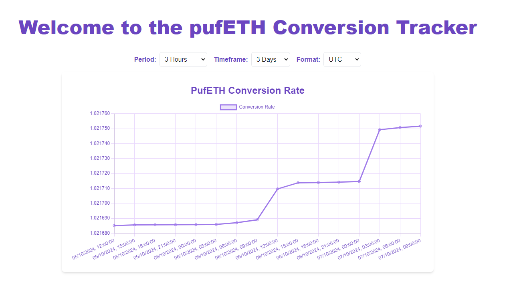

# pufETH Conversion Tracker



### Live Version

Access the published app [here](https://puffer-frontend-42c632068ebb.herokuapp.com/).

## Usage

1. **Select TimeFrame**: Use the timeframe selector to choose the period you want to analyze.
2. **Adjust Period Grouping**: Modify the period settings to group data points and average them accordingly.
3. **Change Time Zone**: Select your preferred time zone from the available options to view data in local time.
4. **View Interactive Chart**: Analyze the conversion rate displayed on the interactive line chart powered by [Chart.js](https://www.chartjs.org/).


## Overview

**pufETH Conversion Tracker** is a web application designed to display the conversion rate of pufETH tokens over time. The conversion rate is calculated using the `totalAssets()` and `totalSupply()` functions from the [`PufferVaultV2`](https://etherscan.io/address/0xD9A442856C234a39a81a089C06451EBAa4306a72#code) smart contract at address `0xD9A442856C234a39a81a089C06451EBAa4306a72`.

The project consists of:

- A **cron job** deployed on Heroku ([puffer-backend](https://github.com/Lyos95/puffer-backend)) that calculates the conversion rate every 5 minutes and stores the data in MongoDB.
- A **microservice** ([puffer-microservice](https://github.com/Lyos95/puffer-microservice)), also deployed on Heroku, which retrieves the stored data based on specified periods and timeframes.
- A **frontend application** ([puffer-frontend](https://github.com/Lyos95/puffer-frontend)) where the data is displayed to the user.

## Features

- **Interactive Line Chart**: Display the conversion rate data in a dynamic line chart powered by [Chart.js](https://www.chartjs.org/), allowing for visual analysis over time.
- **TimeFrame Selection**: Choose a custom timeframe to display data (e.g., from today to three days ago).
- **Period Grouping**: Group and average data points to simplify the chart and enhance readability.
- **Time Zone Support**: Display data in various time zones according to user preference.

## Getting Started

### Prerequisites

- [Node.js](https://nodejs.org/) installed on your machine.
- [npm](https://www.npmjs.com/) or [Yarn](https://yarnpkg.com/) package manager.

### Installation

1. **Clone the repository:**

    ```bash
    git clone https://github.com/Lyos95/puffer-frontend
    ```
2. **Navigate to the project directory:**
    ```bash
    cd puffer-frontend
    ```
3. **Install dependencies:**
    ```bash
    npm install
    ```

### Running the Application
**Local Development:**
Start the development server:
    ```bash
    npm run dev
    ```

**The application will be available at `http://localhost:3000`.**


## Architecture

- **Frontend**: Built with [NextJS](https://nextjs.org/) for a responsive and interactive user interface. The source code is available at [puffer-frontend](https://github.com/Lyos95/puffer-frontend).
- **Cron Job**: The [Cron Job](https://github.com/Lyos95/puffer-backend) service runs scheduled tasks to fetch and store conversion rates in MongoDB.
- **Microservice API**: The [puffer-microservice](https://github.com/Lyos95/puffer-microservice) provides endpoints to retrieve data based on user-specified parameters.

## Potential Enhancements

- **Accessibility Improvements**: Enhance page accessibility, particularly for charts. Consider using accessible chart libraries like [Highcharts](https://www.highcharts.com/).
- **Localization (i18n)**: Implement internationalization to support multiple languages and regional settings.
- **Real-Time Data**: Introduce live data updates using WebSockets or server-sent events for real-time tracking.
- **Additional Metrics**: Include `totalAssets` and `totalSupply` in the charts or provide separate visualizations for deeper insights.